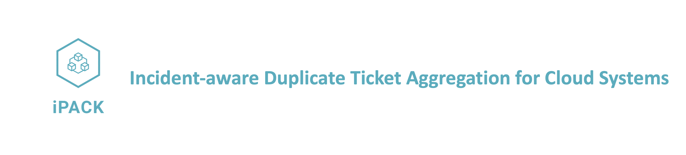

<p align="center">
    <br>
    
    <br>
<p>


------

This is the repository of **iPACK** for the paper "Jinyang Liu, Shilin He, Zhuangbin Chen, Liqun Li, Yu Kang, Xu Zhang, Pinjia He,Hongyu Zhang, Qingwei Lin, Zhangwei Xu, Saravan Rajmohan, Dongmei Zhang, Michael R. Lyu. [Incident-aware Duplicate Ticket Aggregation for Cloud Systems]()" accepted by ICSE 2023.

Our work targets more efficient customer ticket management in large-scale cloud systems. To achieve this goal, we propose to fuse customer-side data (i.e., tickets) and cloud runtime data (i.e., alerts) to aggregate duplicate tickets comprehensively and precisely.


### Dataset

The ticket data used in this work is collected from a real-world cloud vendor, which is highly confidential and contains a lot of personally identifiable information (PII). To protect customers’ privacy, we decide not to release the original dataset. However, to facilitate the community to benefit from our work, we release the source code of iPACK together with some *anonymized data samples* as follows. 


The following data contains anonymized data (all fields are anonymized) to run iPACK. *One can replace them with data in the same format (schema) to adapt iPACK to another system.*

```Historical Alerts (for offline use):``` 

- ./data/train/historical_alerts.csv/ 

``Ticket-Alert Pairs (for offline use):`` 

- ./data/train/ticket_alert_pairs.csv/  

- ./data/test/ticket_alert_pairs.csv/

`` Ticket&Alert Chunk (for online use):  ``

- ./data/test/ticket_alert_chunk.csv/


The following data contains more concrete real-world samples of iPACK's output. Due to privacy concerns, we process the ticket and alert data (rephrase the alert title and ticket summaries, remove sensitive PPI, etc.) without loss of major information. The following (sampled) alerts and tickets are caused by the same incident. iPACK provides the following information to both on-call engineers and support engineers for rapid diagnosis and response to customers.

`` iPACK's real-world output samples:  ``

- ./data/iPACK_output_samples.xlsx/ 


### Installation

1. Install [python >= 3.8](https://www.python.org/downloads/).

2. Install the dependency needed by iPACK with the following command.

   ```pip install -r requirements.txt```


### Execution (Offline Learning)

**Step1**: Alert Parsing: parse alerts to events producing two more features *EventId* and *EventTempalte*.

```
python alert_parsing.py --file "../data/train/historical_alerts.csv" --outdir "../data/train/"
python alert_parsing.py --file "../data/train/train_ticket_alert_pairs.csv" --outdir "../data/train/"
python alert_parsing.py --file "../data/test/test_ticket_alert_pairs.csv" --outdir "../data/test/"
```

**Step2**: Incident Profiling: learning static event relations.

- Input: historical events

- Output: learned PMI values for event pairs

```
python incident_profiling.py --train --file ../data/train/historical_alerts_parsed.csv --outdir "./ipack_results/"
```

**Step3**: Ticket Event Correlation: train the AIN model.

- Input: alert-event pairs

- Output: trained AIN

```
python ticket_event_correlation.py --train --file ../data/train/train_ticket_alert_pairs_parsed.csv --outdir "./ipack_results/ain_results"
```


### Execution (Online Ticket Aggregation)

Utilize *learned PMI values* and *trained AIN* to conduct ticket aggregation within a chunk of data.

- Input: a chunk of data (tickets and alerts within a time window)
- Output: aggregated tickets

```
python online_aggregation.py --file ../data/test/ticket_alert_chunk.csv --outdir "./ipack_results/"
```


### Efficiency of iPACK

We evaluate the time of iPACK's each step with 1,000,000 alert-ticket pairs. We run iPACK on a CentOS linux server with 60GB RAM. The CPU is Intel(R) Core(TM) i7-5930K CPU @ 3.50GHz.  The AIN is trained and tested with the GPU acceleration of NVIDIA GeForce GTX TITAN X. 

- Online Parts (serve online and run every five minutes)

| Step                                                         | Time Taken |
| :----------------------------------------------------------- | ---------- |
| Alert Parsing (Section III-B)                                | 3.69 s     |
| Incident Profiling (Dynamic Event Graph Construction, Section III-C-2) ) | 0.03 s     |
| Ticket-Event Correlation (AIN Inference, Section III-D)      | 23.95 s    |
| Total                                                        | 27.67 s    |

- Offline Parts (precomputed and updated every month)

| Step                                                         | Time Taken |
| :----------------------------------------------------------- | ---------- |
| Alert Parsing (Section III-B)                                | 3.94 s     |
| Incident Profiling (Static Event Relation Learning, Section III-C-1) ) | 942.99 s   |
| Ticket-Event Correlation (AIN Training, Section III-D) \*    | 1074.39 s  |
| Total                                                        | 2021.31 s  |

\* For offline parts, AIN is trained to convergence with 14 epochs using a batchsize=1024.

